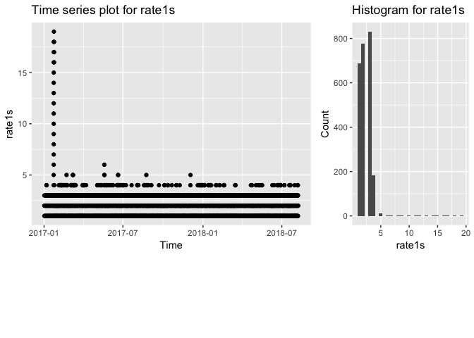
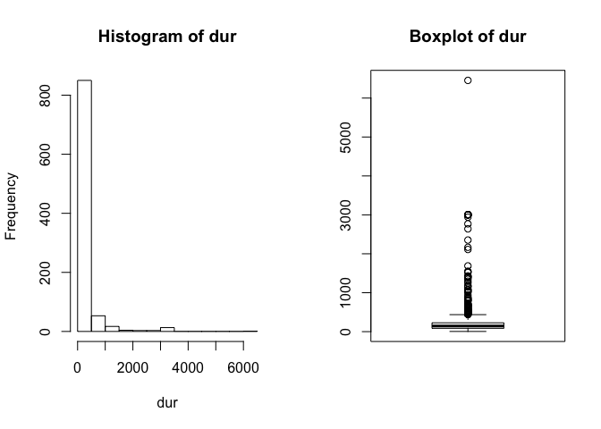

This project is for a database analaysis of an anonymous company. The company wants to know if there is any insight can be drawn from their simple netwrok.

# Libraries used in this project
* RSQLite
* rjson
* dplyr
* ggplot2
* gridExtra
* psych
* forecast

# Connect to the database

```r
# loading the database file to r
library("RSQLite")
filename <- "sqlite.db"
sqlite.driver <- dbDriver("SQLite")
db <- dbConnect(sqlite.driver,
                dbname = filename)
```

## Check the table names
Before loading the tables in question, I check the tables available in the database. 


```r
dbListTables(db)
```

```
## [1] "docker"     "ds"         "exec"       "io"         "open"      
## [6] "openma"     "tcpaccept"  "tcpconnect" "tcplife"
```

Upon examining all the tables, it seemed that they are less useful for this project. In fact, some of these tables have as few as zero and 2 instances such as *open* and *docker* tables, respectively. Thus, I import the *exec* and *tcplife* tables. 


```r
## reading the exec table 
exec <- dbReadTable(db,"exec")
tcplife <- dbReadTable(db, "tcplife")
```

# Data wrangling and exploration

The *ts* variable is transformed to date type with an initial date of 1/1/2017. *ppid* and *path* are changed to factor.


```r
# starting date is given arbitrarily
exec$ts <- as.Date(exec$ts, origin = "2017-1-1")
exec$ppid <- as.factor(exec$ppid)
exec$path <- as.factor(exec$path)
exec$exe <- as.factor(exec$exe)
```

## Extracting data from JSON column
*rates* column is transformed to separate columns, *rate1s* and *rate5s*.


```r
## splitting the rates column to rate1s and rate5s and dropping rates column
library("rjson")
rates_df <- do.call(rbind.data.frame, lapply(exec$rates, fromJSON))
names(rates_df) <- c("rate1s", "rate5s")
exec <- cbind(exec[-8], rates_df)
```

## Function to plot a time series plot and a histogram

I created this function to make it easier for me to plot a time series and a histogram plots for each variable. It's used for *exec* and *tcplife*.


```r
## the inputs are a data frame and a vector of the variables in question
library("ggplot2")
library("gridExtra")
plt_fun <- function(df, var_vec){
  for (p in 1:length(var_vec)){
    x = df[,names(df)==var_vec[p]]
    ts_plt <- ggplot(df) + 
      geom_point(aes(ts, x)) +
      ggtitle(paste("Time series plot for", var_vec[p])) +
      xlab("Time") +
      ylab(paste(var_vec[p]))
    hist_plt <- ggplot(df) +
      geom_histogram(aes(x)) +
      ggtitle(paste("Histogram for", var_vec[p])) +
      xlab(paste(var_vec[p])) +
      ylab("Count")
    grid.arrange(ts_plt, hist_plt, ncol=2, heights=c(3,1), widths=c(2/3,1/3))

  }
}
```

## Plots of the exec table
Here, I call the function to plot the variables of *exec*.


```r
plts1 <- c("ts", "depth", "rate1s", "rate5s")
plt_fun(exec, plts1)
```

<!-- --><!-- --><!-- --><!-- -->

## More exploration of *exec*

Curiosity led me to go beyond the tasks required. By checking the *exe* variable, I find that *python* is the most used application followed by *sh* and *sed*.


```r
library("dplyr")
count(exec,exe) %>% arrange(desc(n)) %>% head()
```

```
## # A tibble: 6 x 2
##   exe         n
##   <fctr>  <int>
## 1 python    786
## 2 sh        575
## 3 sed       565
## 4 lpstat    555
## 5 ifquery     4
## 6 auplink     2
```


## Reading the *tcplife* table

By examining the structure of the data of *tcplife*, I find that the types of some variables need to change. I expected the *lport* to be a factor, but it seems it has a unique value for each observation. Thus, I'll change it to numeric.


```r
tcplife$lport <- as.numeric(tcplife$lport)
tcplife$rport <- as.factor(tcplife$rport)
tcplife$ts <- as.Date(tcplife$ts, origin = "2017-1-1")
```

## Plots of the *tcplife* table


```r
tcplife$rport <- as.numeric(tcplife$rport)
plts2 <- c("rx", "tx", "dur", "lport", "rport")
plt_fun(tcplife, plts2)
```

<!-- --><!-- --><!-- --><!-- --><!-- -->

## More exploration of *tcplife*

Digging more on the *tcplife*, I find that in *rport*, the majority of the traffic goes through port 80 with a total number of 833 observations.


```r
count(tcplife,rport)
```

```
## # A tibble: 2 x 2
##   rport     n
##   <dbl> <int>
## 1  1.00   111
## 2  2.00   833
```


# Statistics


```r
library(psych)
dur <- tcplife$dur
```

## Checking the shape of the distribution and visualizing the outliers

I do this to have a feel of the data I'm dealing with. I find that there is a very extreme data point, and some less extreme data points.


```r
par(mfrow=c(1, 2))
hist(dur)
boxplot(dur)
title("Boxplot of dur")
```

<!-- -->

## Some statistics of *dur*

Here, I show some of the statistics of the *dur* variable. We find that the range is pretty high and the data is skewed as expected.


```r
stats <- describe(dur, IQR = T, quant = c(.25, .75))
as.data.frame(stats)
```

```
##   vars   n     mean       sd median trimmed      mad  min     max   range
## 1    1 944 261.2191 479.3319 144.65 162.626 97.97021 5.04 6454.02 6448.98
##       skew kurtosis       se     IQR   Q0.25    Q0.75
## 1 5.793361 45.24613 15.60092 141.285 85.5125 226.7975
```

## Determining the upper and lower limits of the outliers

From the above statistics, I'm interested more in the IQR to see the cutoff points of the outliers. I use the 1.5*IQR rule.


```r
ul <- stats$Q0.75 + 1.5*stats$IQR
ll <- stats$Q0.25 - 1.5*stats$IQR
```

The upper and lower limits are 438.725 and -126.415, respectively
.
## A subset of *dur* without the most extreme value

I created a subset of the data without the most extreme observation, observation number 875.


```r
dur_trim1 <- dur[-which(tcplife$dur == stats$max)]
```

## A subset of *dur* without the data points above 1.5*IQR

Here, I created another subset without the observations that fall above the upper limit. There are 108 observations that are considered outliers. 


```r
dur_trim <- dur[-which(tcplife$dur>ul)]
```

## Visualization of the three cases

The three cases are plotted side-by-side.


```r
par(mfrow=c(1, 3))
boxplot(dur)
title("original")
boxplot(dur_trim1, border = "red")
title("w/o the extreme outlier")
boxplot(dur_trim, border = "blue")
title("w/o the outliers above 1.5IQR")
```

<!-- -->

## More analysis of *dur*

I'm not sure if *pid* refers to the user ID or not, but assuming it is, the table below shows the most frequent users. Matching the top 5 users to the same ID in *exec*, we find that *python* is the application used. Also, matching the user with maximum *dur* in both tables, I find that *python* is the application that spent time at the most.


```r
count(tcplife, pid) %>% arrange(desc(n)) %>% head(5) -> top_users
left_join(top_users, exec, by = "pid") %>% select(pid, exe)
```

```
## # A tibble: 5 x 2
##     pid exe   
##   <int> <fctr>
## 1 31115 python
## 2 30682 python
## 3 30052 python
## 4 30499 python
## 5 30711 python
```

```r
most_extr <- tcplife[which(tcplife$dur==stats$max),] %>% select(pid)
filter(exec, pid==most_extr[,1]) %>% select(pid, exe)
```

```
##     pid    exe
## 1 31008 python
```

# Modelling

## Modelling and forcasting the *dur* variable

Looking at the time series plot, there doesn't seem to be seasonal fluctuation. Therefore, I use the simple moving average approach. Assuming the data are for the workdays of the week, I set the order of the moving average to 5.


```r
library("forecast")
par(mfrow=c(1, 1))

fit <- ma(dur, order = 5) 
forecast <- forecast(fit, h = 25)
plot(forecast)
```

<!-- -->

## Modelling and forcasting the *lport* variable


```r
fit <- ma(tcplife$lport, order = 5) 
forecast <- forecast(fit, h = 25)
plot(forecast)
```

<!-- -->


# About the tables (extra credit)

* My guess is that *exec* table is a record of the active applications in the network with their file directory path and other related data.

* For the *tcplife* table, I think it is data for the duration that the users are virtually active. There are some outliers, which indicate that some users are more present than the majority of the users. My guess is that these users could be the IT team or data scientists since *python* was the most used application. 


**Acknowledgement**

I'd like to thank the anonymous company for this opportunity and for giving me access to their valuable datasets.

**Contact**

Nabeel Hamoud, [LinkedIn](https://www.linkedin.com/in/nmhamoud).
